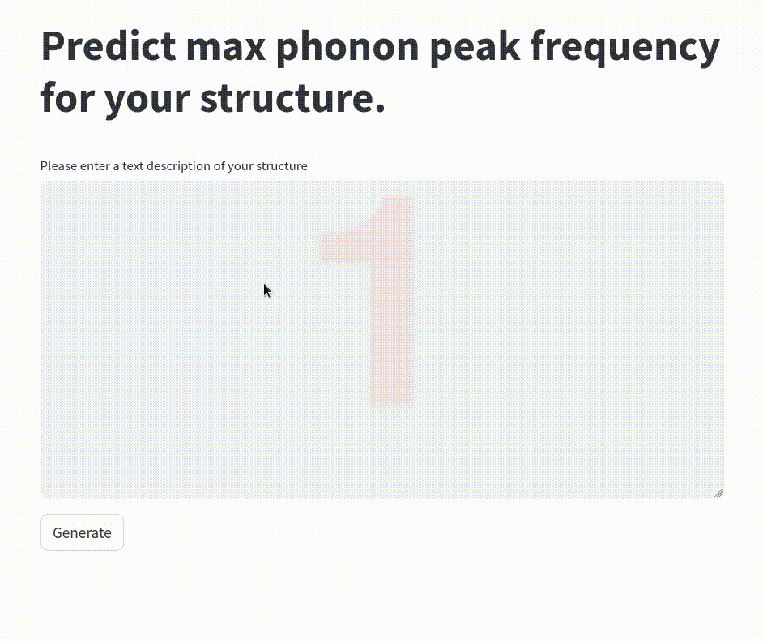

# LLM_Hackathon_2024
This repo contains code and data of our contribution to the 2024 LLM Hackathon, materials' property prediction from textual descriptions of structures and their bonding properties.

## Motivation
We are interested in machine learning of materials' properties and want to understand the
importance of features curated from [orbital-based bonding analysis](http://cohp.de/).
In the LLM Hackathon 2024, we finetuned an LLM for prediction of a vibrational property
via textual descriptions of materials, both **with** and **without** additional bonding information.
The target property of interest was the frequency of the highest phonon DOS peak, which is interesting
for the discovery of new thermoelectric materials.
A previous study by [Aakash Naik et al.](https://doi.org/10.1038/s41597-023-02477-5) already
demonstrated the importance of bonding features for this target in an RF model.

We generated textual descriptions of the 1264 structures of the [MatBench phonon dataset](https://matbench.materialsproject.org/Leaderboards%20Per-Task/matbench_v0.1_matbench_phonons/).
These descriptions were generated both with [Robocrystallographer](https://hackingmaterials.lbl.gov/robocrystallographer/index.html),
describing structural features as structure type, coordination environments etc. and [LobsterPy](https://jageo.github.io/LobsterPy/),
describing covalent bonding features of the structure like ICOHP values. The bonding database was
generated by A. Naik et al. and is publicly [available](https://doi.org/10.5281/zenodo.8091844).

These textual descriptions of 1264 structures were then transformed into LLM prompts (see schema) by 
defining 
- **an Instruction**
  - 'What is the frequency of the highest frequency optical phonon mode peak in 
  units of 1/cm given the following description?'
- **an Input**
  - LobsterPy + Robocrys description of structure **OR** only Robocrys description of structure
- **a Response**
  - 'The frequency of the highest frequency optical phonon mode peak is 350.5858 1/cm.'

We finetuned a Llama 3 model using [unsloth](https://github.com/unslothai/unsloth?tab=readme-ov-file) (one train/test/val split: 0.64/0.2/0.16) and trained it for 10 epochs
with a validation step after each epoch. The textual output was converted back into
numerical frequency values for computation of MAEs and RMSEs.

Finetuning was performed using a NVIDIA A100 80GB gpu.

We also provide a user-friendly GUI so you can chat with the fine-tuned model and ask about your own material. 
Below is a snapshot of the GUI in action.

--------------------
## Preliminary results
To our knowledge, orbital-based bonding features have not been used in LLM-based prediction of materials' 
properties so far.
Our first experiments shows bonding-based information to be relevant for predicting the
frequency of the highest energy phonon DOS peak in LLMs:
The best epoch using both Robocrys and LobsterPy text data yields a test MAE of 38 1/cm,
while the best epoch of the model trained solely with Robocrys data yields a test MAE of 44 1/cm.

Both performances are comparable to other models of
the [MatBench test suite](https://matbench.materialsproject.org/Leaderboards%20Per-Task/matbench_v0.1_matbench_phonons/).

--------------------
## Todos and Outlook

- Further test models performance using different tokenizers trained on material science text
- Test model accuracy using LLM specific metrics
- Systematically add and remove information to evaluate feature importances

--------------------
## Project structure
The folder *Data_generation* contains code and data to create the LLM instructions, inputs and responses.
Please note that only the Robocrys text data is generated from scratch there, the raw LobsterPy data and targets
can be found [elsewhere](https://doi.org/10.1038/s41597-023-02477-5).

The folder *Models* contains utilities and scripts to finetune a Llama 3 model for materials property prediction 
and evaluate the output.

The environment used for data generation can be build from *requirements_robocrys.txt*.
The environment used for LLM finetuning can be build from *environment_llm.yml* 
(we followed the [unsloth installation instructions](https://github.com/unslothai/unsloth?tab=readme-ov-file) here).

The folder *ChatBot* contains the scripts to load the locally saved gguf model file in [Ollama](https://github.com/ollama/ollama) via `Modelfile.` 
Once this is done, just run the streamlit app using `streamlit run LLAMA_chatbot.py`

--------------------

## Our team

We are both PhD students in the group of [Janine George](https://jageo.github.io/).
You can find us on GitHub ([Aakash](https://github.com/naik-aakash), [Katharina](https://github.com/kaueltzen)) and 
LinkedIn ([Aakash](https://www.linkedin.com/in/aakashnaik23/), [Katharina](https://www.linkedin.com/in/katharina-ueltzen)).

